<style>


body {
    counter-reset: chapter;
		font-size: 14pt;
    max-width: 900px;
    margin: 0 auto;
    padding: 25px;
    font-color: #666;
  }
	li {
		margin-top: 10px;
		margin-bottom: 40px;
	}
	img {
		border:1px solid #c0c0c0;
	}
	table tr td {
    padding: 2px;
    border-bottom: 1px solid;
		border-color: #000 !important;
  }
  table tr th {
    font-weight: normal !important;
    font-size: 10pt !important;
		border-color: #000 !important;
    background-color: #c0c0c0;
  }
  table tr td {
    background-color: #fff !important;
    font-size: 9pt !important;
  }

	tr, td {
    padding: 2px 4px !important;
  }

  table {
    border-collapse: collapse;
    border-spacing: 0;
    table-layout: auto;
    margin-left: 0px;
    th {
      font-weight: normal !important;
      text-align: center;
      background-color: #c0c0c0 !important;
    }
  }
	h1, h2, h3, h4, h5, h6 {
    font-weight: normal !important;
  }

  h1 {
		font-size: 20pt !important;
    counter-reset: sub-chapter;
		border-bottom: solid 2px #666666; padding: 3px;
  }

  h2 {
		font-size: 18pt !important;
    counter-reset: section;
		border-bottom: solid 1px #666666; padding: 3px;
  }

  h3 {
		font-size: 16pt !important;
    counter-reset: sub-section;
		border-bottom: dotted 1px #666666; padding: 3px;
  }

  h4 {
    counter-reset: sub-sub-section;
  }

  li {
    margin-left: -0.8em;
  }

div.HightSpace {
	margin: 20px;
}

  div.TOC ul {
    counter-reset: section;
  }

  div.TOC {
    margin: 6px;
    padding: 6px;
    border: solid 1px #000;
  }
  div.TOC li {
      list-style: none;
      margin-left: 0em;
  }
  div.TOC ul {
    margin: 0px;
    padding: 0px;
  }
  div.TOC a {
    color: #000;
  }
  div.TOC a:hover {
    color: #00F;
  }


  div.TOC ul>li:before {
      counter-increment : section;
      content : counters(section, '.') '. ';
  }

  div.toc_h1 {
    font-size: 16pt;
    border-bottom: solid 2px #666666; padding: 3px;
  }
  div.toc_h2 {
    font-size: 14pt;
    border-bottom: solid 1px #666666; padding: 3px;
  }
  div.toc_h3 {
    font-size: 12pt;
  }


  h1::before {
    counter-increment: chapter;
    content: counter(chapter) ". ";
  }

  h2::before {
    counter-increment: sub-chapter;
    content: counter(chapter) "." counter(sub-chapter) ". ";
  }

  h3::before {
    counter-increment: section;
    content: counter(chapter) "." counter(sub-chapter) "." counter(section) ". ";
  }

  h4::before {
    counter-increment: sub-section;
    content: counter(chapter) "." counter(sub-chapter) "." counter(section) "." counter(sub-section) ".";
  }

  h5::before {
    counter-increment: sub-sub-section;
    content: counter(chapter) "." counter(sub-chapter) "." counter(section) "." counter(sub-section) "." counter(sub-sub-section) ".";
  }

</style>

SQL入門

リレーショナルデータベースとSQLの基礎について

<div style="page-break-before:always"></div>

<font size=5>目次</font>
<div class="TOC">

<!-- @import "[TOC]" {cmd="toc" depthFrom=1 depthTo=6 orderedList=false} -->
<!-- code_chunk_output -->
- [はじめに](#はじめに)
  - [前提条件](#前提条件)
- [データベースについて](#データベースについて)
  - [データベースの種類](#データベースの種類)
  - [RDBMSについて](#rdbmsについて)
    - [RDBMSの概要](#rdbmsの概要)
    - [主なRDBMSの製品](#主なrdbmsの製品)
    - [SQLiteについて](#sqliteについて)
  - [SQLについて](#sqlについて)
- [RDBMSの環境構築](#rdbmsの環境構築)
  - [SQLiteをインストールする](#sqliteをインストールする)
    - [ダウンロード](#ダウンロード)
    - [インストール](#インストール)
    - [動作確認](#動作確認)
    - [SQLite起動時のコマンドについて](#sqlite起動時のコマンドについて)
  - [学習用データの準備](#学習用データの準備)
    - [テーブルを作成する](#テーブルを作成する)
    - [データを作成する](#データを作成する)
- [SQLの基礎](#sqlの基礎)
  - [学習用サンプルデータ](#学習用サンプルデータ)
    - [authorsテーブル](#authorsテーブル)
    - [profileテーブル](#profileテーブル)
    - [booksテーブル](#booksテーブル)
    - [学習用サンプルテーブル同士の関連図](#学習用サンプルテーブル同士の関連図)
    - [SQLの書き方について](#sqlの書き方について)
    - [データを検索する(SELECT文)](#データを検索するselect文)
    - [シンプルなSELECT文](#シンプルなselect文)
    - [検索条件を付ける(WHERE句)](#検索条件を付けるwhere句)
<!-- /code_chunk_output -->

</div> 

# はじめに
当ドキュメントは、SQL未経験者が、基本的なSQLについて習得することを目的とする。

尚、当ドキュメントで説明するSQLついては、必要最低限の機能に限られるので、より多くの機能を知りたい場合は、書籍やネット等でより詳しい解説を参照することをお勧めする。

※「ゼロからはじめるデータベース操作 ミック著 翔泳社」がお勧め

https://www.shoeisha.co.jp/book/detail/9784798144450

## 前提条件

当ドキュメントの対象者を以下に示す。

- PCの操作が滞りなく出来ること
- SQL未経験、若しくはそれに近しいこと

 
# データベースについて
データベースとは、あらゆる種類のデータを蓄積し、必要な時に必要なデータを取り出すことができる仕組みのことである。

コンピュータシステムにおいては、様々な場面で、色々な種類のデータベースが活用され、殊に業務系システムにおいては、複雑な構成を持つデータの設計、開発、運用が行われている。

当章では、データベースの中でもコンピュータで用いるデータベースの種類と製品について概要を説明する。

## データベースの種類
データベースには、その用途により、色々な種類がある。主なデータベースの種類について、以下に示す。

|種類|説明|備考|
|:---|:---|:---|
|階層型データベース|データを階層(ツリー)構造で管理するデータベース。|ディレクトリ構造をイメージすると良い。大昔の主流。現在は殆ど使用されていない。|
|リレーショナルデータベース|Excelで良く見る二次元の表(テーブル)で構成され、複数テーブルの関連も表現できる。|	**業務系システムでは、最も利用されているデータベース。※本書で説明するデータベース**|
|オブジェクト指向データベース|データと操作をまとめたオブジェクトを保存するためのデータベース。|業界歴20年の筆者でも目にしたことがなく、これと言った製品もない様である。|
|ドキュメント型データベース|XMLやJSON形式のデータに特化したデータベース|XMLやJSONを多用するシステムでは、良く利用されている。主な製品にMongoDBがある。|
|キー・バリュー型データベース|検索に使うキー(Key)とデータ(Value)の単純な組み合わせで構成されるデータベース。|	単純な構造のため、大容量のデータを高速処理するのに適しており、ビッグデータの取り扱いなどで最も使用されている。主な製品にRedis、Amazon DynamoDB(AWS)などがある。|

当ドキュメントでは、リレーショナルデータベースについて説明する。

## RDBMSについて
RDBMSとは Relational Database Management Systemの略称でリレーショナルデータベースを管理するシステムのことである。

### RDBMSの概要
RDBMSでは、データは二次元の表からなるテーブル群により構成され、テーブルは、列と行で構成される。

例：芸能人テーブル

|行|[列]ID列|[列]名前|[列]年齢|[列]職業ID|
|:---|:---|:---|:---|:---|
|1行目|1|木村太郎|82|1|
|2行目|2|佐藤二朗|50|4|
|3行目|3|北島三郎|83|2|
|n行目|4|岸部四郎|70|3|

また、テーブルとテーブルとの間に関連がある場合、それを表現できる。例えば以下の「職業」テーブルは、上記の芸能人テーブルとの間に、職業IDを通じて関連があり、結合した結果を出力することができる。

例：職業テーブル

|行|[列]職業ID|職業名|
|:---|:---|:---|
|行|職業ID|職業名|
|1行目|1|ジャーナリスト|
|2行目|2|歌手|
|3行目|3|タレント|
|n行目|4|俳優|

芸能人テーブルと職業テーブルを職業IDで結合した結果

|行|[列]ID列|[列]名前|[列]年齢|[列]職業名|
|:---|:---|:---|:---|:---|
|1行目|1|木村太郎	82|ジャーナリスト|
|2行目|2|佐藤二朗	50|俳優|
|3行目|3|北島三郎	83|歌手|
|n行目|4|岸部四郎|70|タレント|

### 主なRDBMSの製品
2020年現在の主なRDBMSについて、以下に示す。

|製品|開発元|備考|
|:---|:---|:---|
|PostgreSQL|オープンソース||	　
Oracle Database 12c	オラクル社||	　
|SQL Server 2017|マイクロソフト|
|MySQL|オープンソース|現在はオラクル社が開発|
|MariaDB|オープンソース|MySQLの派生版|
|SQLite|SQLiteコンソーシアム|スタンドアロン型。パブリックドメイン|

当ドキュメントでは、環境構築が容易なこと、製品独自の機能については触れない(標準SQLのみ)ことから、SQLiteを使用して説明する。

### SQLiteについて
SQLiteは、軽量、かつ、コンパクトなスタンドアロン型RDBMSで、環境構築も容易であり、その特性から、アプリケーションやデバイスでのローカルデータストレージとして活用される。

## SQLについて
SQL(Structured Query Language)は、RDBMSのデータを操作(テーブルの作成、データの検索・更新・追加・削除)するための問合せ言語である。

SQLには、標準SQL規格と、製品毎に拡張されたもの(これを方言と呼ぶエンジニアもいる)がある。当ドキュメントでは、標準SQL規格の内容についてのみ説明する。

 
# RDBMSの環境構築
当章では、スタンドアロン型RDBMSのSQLiteについて、環境構築の手順を説明する。

## SQLiteをインストールする
### ダウンロード
1. SQLiteのダウンロードサイトにアクセスする。
[https://www.sqlite.org/download.html](https://www.sqlite.org/download.html)
1. SQLiteのダウンロードサイト
<span class="HightSpace"/>
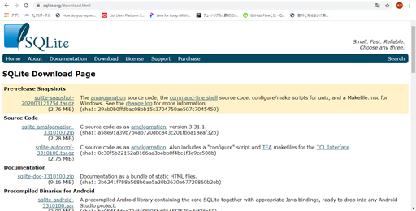
<span class="HightSpace"/>
1. 下方向にスクロールして「Precompiled Binaries for Windows」項目の「sqlite-tools-win32-x86-バージョン].zip」を選択してダウンロードする。
<span class="HightSpace"/>
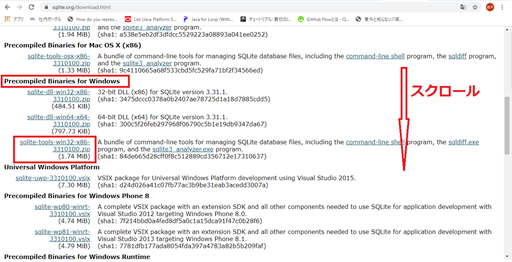
<span class="HightSpace"/>

### インストール
1. ダウンロードしたファイルは、zipで圧縮されているので、これを展開する。
<span class="HightSpace"/>
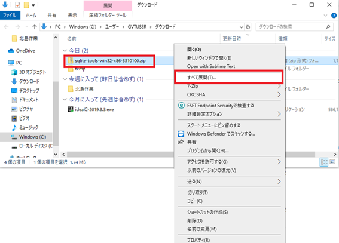
<span class="HightSpace"/>
1. 展開した結果
<span class="HightSpace"/>
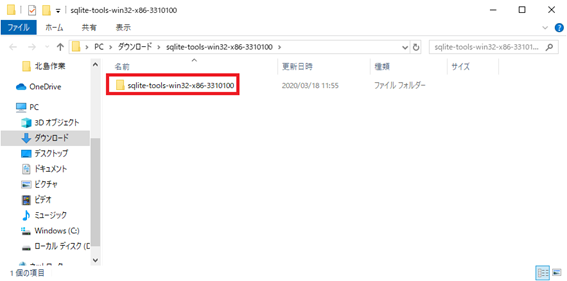
<span class="HightSpace"/>
1. 展開したフォルダ名を「sqlite」にリネームする。
<span class="HightSpace"/>
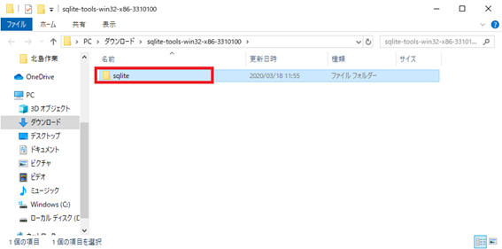
<span class="HightSpace"/>
1. リネームしたフォルダをC:\ディレクトリに移動する。
<span class="HightSpace"/>
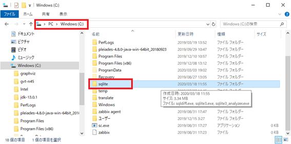
<span class="HightSpace"/>

### 動作確認

1. スタートメニューからコマンドプロンプトを起動する。
<span class="HightSpace"/>
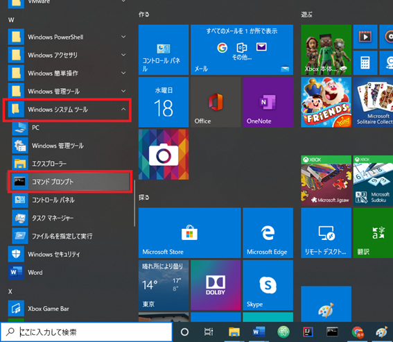
<span class="HightSpace"/>
1. コマンドプロンプトが起動した状態
<span class="HightSpace"/>
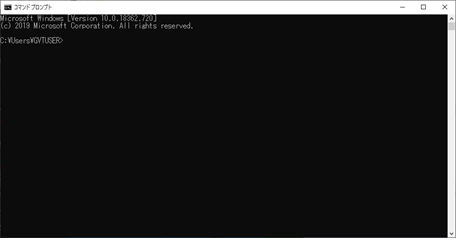
<span class="HightSpace"/>
1. コマンドプロンプトに以下のコマンドを入力し、Enterキーを押下してコマンドを実行する。
```dos
cd C:\sqlite
```
<span class="HightSpace"/>
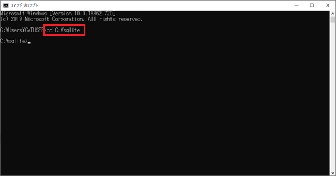
<span class="HightSpace"/>
1. コマンドプロンプトに以下のコマンドを入力し、Enterキーを押下してコマンドを実行する。
```dos
sqlite3 ExampleDatabase
```
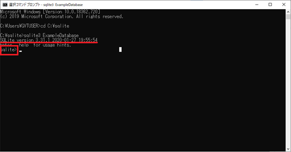
```sqlite >```  が表示されたら動作確認は成功である。

```sqlite >```  に、SQL文を入力し、Enterキーを押下するとSQLが実行できる。

### SQLite起動時のコマンドについて

SQLiteの起動時に以下のコマンドを入力した。

```dos
sqlite3 ExampleDatabase
```
sqlite3は、SQLiteの起動コマンドで、ExampleDatabaseは、対象のデータベースである。尚、指定した名前のデータベースが存在しない場合は、データベースが新規作成される。

## 学習用データの準備

後の章でSQLを学ぶ際に必要なテーブルとデータを作成する。以下のSQLを実行する。尚、各SQLの意味については、後の章で説明する。

### テーブルを作成する
以下のSQL文をコピーして ```sqlite > ```  にペーストしてEnterキーを押下する。

```sql
CREATE TABLE authors (
id INTEGER PRIMARY KEY,
name TEXT NOT NULL,
  ruby TEXT NOT NULL
);
CREATE TABLE books (
  id INTEGER PRIMARY KEY,
  author_id INTEGER,
  title TEXT NOT NULL,
  price INTEGER
);
CREATE TABLE profile (
  id INTEGER PRIMARY KEY,
  author_id INTEGER,
  age,
  address TEXT,
  memo TEXT
);
```

実行結果

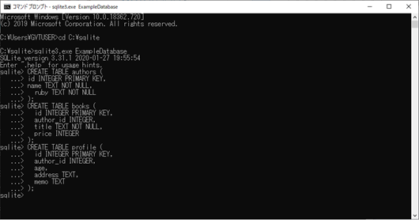

### データを作成する

```sql
INSERT INTO authors(id, name, ruby) values(1, '坂上田村麻呂', 'さかのうえのたむらまろ');
INSERT INTO authors(id, name, ruby) values(2, '大伴家持', 'おおとものやかもち');
INSERT INTO authors(id, name, ruby) values(3, '安倍貞任', 'あべのさだとう');
INSERT INTO authors(id, name, ruby) values(4, '源義家', 'みなもとのよしいえ');
INSERT INTO authors(id, name, ruby) values(5, '丹比郎女', 'たじひのいらつめ');

INSERT INTO books(id, author_id, title, price) values(1, 5, '君にもできるJava入門',2500);
INSERT INTO books(id, author_id, title, price) values(2, 4, 'Javaの基礎の基礎の木曽義仲', 1800);
INSERT INTO books(id, author_id, title, price) values(3, 5, '続！君にもできるJava入門', 2200);
INSERT INTO books(id, author_id, title, price) values(4, 5, '決定版！君にもできるJava入門', 2800);
INSERT INTO books(id, author_id, title, price) values(5, 2, 'データベース始めました', 3000);
INSERT INTO books(id, author_id, title, price) values(6, 1, '究極のRDBMS', 5000);
INSERT INTO books(id, author_id, title, price) values(7, 5, 'オブジェクト指向よ永遠に', 4500);
INSERT INTO books(id, author_id, title, price) values(8, 2, 'IntelliJ IDEAのアイデア集', 400);
INSERT INTO books(id, author_id, title, price) values(9, 4, 'コンパイルな日々', 1300);
INSERT INTO books(id, author_id, title, price) values(10, 4, 'UMLは伊達じゃない', 2500);

INSERT INTO profile(id, author_id, age, address, memo) values(1, 1, 38, '大和国', '元軍人');
INSERT INTO profile(id, author_id, age, address, memo) values(2, 2, 19, '山城国', '作詞家');
INSERT INTO profile(id, author_id, age, address, memo) values(3, 4, 25, '山城国', '源氏の棟梁');
INSERT INTO profile(id, author_id, age, address, memo) values(4, 5, 51, '大和国', '有名作詞家の母');
```

実行結果

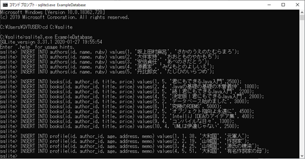

# SQLの基礎
当章では、SQLの基礎について説明する。尚、SQLの実行環境は、前章で用意したものを使用するため、準備ができていない場合は前章を読み直すこと。

また、SQLは、コマンドプロンプトで実行するため、事前にsqliteを起動しておくこと

SQLiteの起動コマンド

```dos
cd C:\sqlite
sqlite3 ExampleDatabase
```

## 学習用サンプルデータ
前章で用意したサンプルデータについて説明する。サンプルデータは、authors, profile, booksの3テーブルにそれぞれデータが登録されている。また、3.1.4.に3テーブルの関連図(E-R図)を掲載しているが、この時点では、理解できなくても良い。

 
### authorsテーブル
|id|name|ruby|
|---:|:---|:---|
|1|坂上田村麻呂|さかのうえのたむらまろ|
|2|大伴家持|おおとものやかもち|
|3|安倍貞任|あべのさだとう|
|4|源義家|みなもとのよしいえ|
|5|丹比郎女|たじひのいらつめ|

### profileテーブル
|id|author_id|age|address|memo|
|---:|---:|:---|:---|:---|
|1|1|38|大和国|元軍人|
|2|2|19|山城国|作詞家|
|3|4|25|山城国|源氏の棟梁|
|4|5|51|大和国|有名作詞家の母|

###	booksテーブル
|id|author_id|title|price|
|---:|---:|:---|:---|
|1|5|君にもできるJava入門|2500|
|2|4|Javaの基礎の基礎の木曽義仲|1800|
|3|5|続！君にもできるJava入門|2200|
|4|5|決定版！君にもできるJava入門|2800|
|5|2|データベース始めました|3000|
|6|1|究極のRDBMS|5000|
|7|5|オブジェクト指向よ永遠に|4500|
|8|2|IntelliJ IDEAのアイデア集|400|
|9|4|コンパイルな毎日|1300|
|10|4|UMLは伊達じゃない|2500|


### 学習用サンプルテーブル同士の関連図

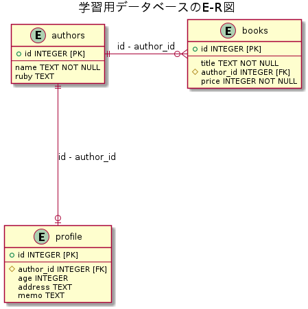


### SQLの書き方について
SQLの書き方について、以下の点を留意すること

1. SQLの構文は、大文字、小文字の区別がない。
これは、例えば、SELECT、Select、selectといずれの書き方でも正常なSQL文として処理されることを示す。
但し、見易さの考慮は重要であるため、大文字なら大文字、小文字なら小文字、先頭のみ大文字ならその様に統一して書くことが重要である（大抵のプロジェクトではルールとして決められている）
尚、本ドキュメントでは、SQLの予約語は大文字、テーブルや列などは小文字で統一している。
1. SQL文の終わりには「;」(セミコロン)を付ける。
SQL文は、セミコロンがないと改行するだけで実行されない。初学者が陥りやすいミスの一つなので、気を付ける必要がある。

### データを検索する(SELECT文)
当節では、学習用データを使用して、SQLでデータを検索する方法について説明する。
### シンプルなSELECT文
1. SQL文
以下のSQLを実行してみよう
    ```sql
    SELECT title FROM books;
    ```
1. 実行結果
成功すると、SQLiteは以下の結果を出力する。
    ```dos
    君にもできるJava入門
    Javaの基礎の基礎の木曽義仲
    続！君にもできるJava入門
    決定版！君にもできるJava入門
    データベース始めました
    究極のRDBMS
    オブジェクト指向よ永遠に
    IntelliJ IDEAのアイデア集
    コンパイルな日々
    UMLは伊達じゃない
    ```
1. 解説
SELECT文の基本構文を以下に示す。
    - 1つの列を指定してテーブルからデータを検索する場合
**SELECT** [列名] **FROM** [テーブル名] ;
今回実行したSQLでは、booksテーブルからtitle列のデータを検索した。
    - 2つ以上の列を指定してテーブルからデータを検索する場合(列名と列名の間をカンマで区切る)
**SELECT** [列名1] , [列名2] **FROM** [テーブル名] ;
例えば、**books** テーブルから、**title** 列と **price** 列のデータを検索したい場合は

    ```sql
    SELECT title, price FROM books;
    ```
    実行結果

    ```dos
    君にもできるJava入門|2500
    Javaの基礎の基礎の木曽義仲|1800
    続！君にもできるJava入門|2200
    決定版！君にもできるJava入門|2800
    データベース始めました|3000
    究極のRDBMS|5000
    オブジェクト指向よ永遠に|4500
    IntelliJ IDEAのアイデア集|400
    コンパイルな日々|1300
    UMLは伊達じゃない|2500
    ```
    と、title列とprice列のデータが出力される。

尚、テーブルの全ての列を出力したい場合、列名の代わりに<font size=3> * </font>（アスタリスク）を指定すると全ての列のデータを検索することができる。

列名に*(アスタリスク)を指定した場合のSQL

```sql
SELECT * FROM books;
```

実行結果

```
1|5|君にもできるJava入門|2500
2|4|Javaの基礎の基礎の木曽義仲|1800
3|5|続！君にもできるJava入門|2200
4|5|決定版！君にもできるJava入門|2800
5|2|データベース始めました|3000
6|1|究極のRDBMS|5000
7|5|オブジェクト指向よ永遠に|4500
8|2|IntelliJ IDEAのアイデア集|400
9|4|コンパイルな日々|1300
10|4|UMLは伊達じゃない|2500
```

### 検索条件を付ける(WHERE句)

ある条件を満たした行のみ出力する場合、SQLでは、WHERE句を付けて検索する。

1. SQL文
以下のSQL文を実行してみよう
    ```sql
    SELECT * FROM books WHERE price >= 4000;
    ```
1. 実行結果
    ```
    6|1|究極のRDBMS|5000
    7|5|オブジェクト指向よ永遠に|4500
    ```
1. 解説
WHERE句を付けたSELECT文の基本構文について以下に示す。
**SELECT** [列名] **FROM** [テーブル名] **WHERE** [条件式]
    - WHERE句は、FROM句の直後に記述する。
    - WHERE句の条件式で使用できる演算子を以下に示す。

|演算子|説明|形式|
|:---|:---|:---|
|=|～と等しい|[列名] = 100, [列名] = '山田太郎'|
|<>|～と等しくない|[列名] <> 100, [列名] <> '山田太郎'|
|>=|～以上|[列名] >= 100|
|<=|～以下|[列名] <= 100|
|>|～より大きい|[列名] > 100|
|<|～より小さい|[列名] < 100|
|IS NULL|～がNULLである|[列名] IS NULL|
|IS NOT NULL|～がNULLではない|[列名] IS NOT NULL|

※	比較演算子はNULLと比較することはできない ([列名] = NULLや[列名] <> NULLは無効)ので、IS NULL、IS NOT NULL演算子を使用すること
4.3.3.	AND演算子
AND演算子は、WHERE句に指定した全ての条件式が真である時のみ真となり、それ以外は偽となる。

(1) SQL文

以下のSQL文を実行してみよう。


SELECT *
FROM books
WHERE price >= 2500
AND author_id = 5
;

(2) 実行結果

1|5|君にもできるJava入門|2500
4|5|決定版！君にもできるJava入門|2800
7|5|オブジェクト指向よ永遠に|4500

(3) 解説

AND演算子を付けたSELECT文の基本構文について以下に示す。


SELECT [列名] FROM [テーブル名] WHERE [条件式] AND [条件式];


実行したSQL文では、条件に

author_id = 5
price >= 2500

が指定されており、AND条件の場合は、全ての条件を満たす行だけ検索対象となる。


booksテーブル
id	author_id	title	price	全条件一致
1	5	君にもできるJava入門	2500	〇
2	4	Javaの基礎の基礎の木曽義仲	1800	　
3	5	続！君にもできるJava入門	2200	　
4	5	決定版！君にもできるJava入門	2800	〇
5	2	データベース始めました	3000	　
6	1	究極のRDBMS	5000	　
7	5	オブジェクト指向よ永遠に	4500	〇
8	2	IntelliJ IDEAのアイデア集	400	　
9	4	コンパイルな毎日	1300	　
10	4	UMLは伊達じゃない	2500	　

尚、AND条件は複数記述することが可能でその場合は


WHERE [条件式] AND [条件式] AND [条件式] AND [条件式]...;


と記述する。

4.3.4.	OR演算子

OR演算子は、WHERE句に指定した全ての条件式の内、真であるものが一つ以上あれば真となり、一つもない場合のみ偽となる。

 (1) SQL文

以下のSQL文を実行してみよう。


SELECT *
FROM books
WHERE price >= 2500
OR author_id = 5
;


(2) 実行結果

1|5|君にもできるJava入門|2500
3|5|続！君にもできるJava入門|2200
4|5|決定版！君にもできるJava入門|2800
5|2|データベース始めました|3000
6|1|究極のRDBMS|5000
7|5|オブジェクト指向よ永遠に|4500
10|4|UMLは伊達じゃない|2500

(3) 解説

OR 演算子を付けたSELECT文の基本構文について以下に示す。


WHERE [条件式] OR [条件式] ;


実行したSQL文では、条件に

author_id = 5
price >= 2500

が指定されており、OR条件の場合は、一つ以上の条件を満たす行が検索対象となる。

booksテーブル
id	author_id	title	price	1つ以上一致
1	5	君にもできるJava入門	2500	〇
2	4	Javaの基礎の基礎の木曽義仲	1800	　
3	5	続！君にもできるJava入門	2200	〇
4	5	決定版！君にもできるJava入門	2800	〇
5	2	データベース始めました	3000	〇
6	1	究極のRDBMS	5000	〇
7	5	オブジェクト指向よ永遠に	4500	〇
8	2	IntelliJ IDEAのアイデア集	400	　
9	4	コンパイルな毎日	1300	　
10	4	UMLは伊達じゃない	2500	〇

4.3.5.	検索条件に文字列を指定する
検索条件に文字列を指定する場合、条件とする文字列を 「'」(シングルクォーテーション)で括る必要がある。
※シングルクォーテーションで括るのは、SQL文で文字列を直接記述する場合の書式である。

(1) SQL文

以下のSQL文を実行してみよう。

SELECT title, price
FROM books
WHERE title = 'コンパイルな日々'
;


(2) 実行結果

コンパイルな日々|1300

(3) 解説

検索条件に文字列を指定する場合の基本構文を以下に示す。


SELECT [列名] FROM [テーブル名] WHERE [列名] = '[検索文字列]' ;

4.3.6.	LIKE句(前方一致)
LIKE句(前方一致) は、文字列の先頭数文字と比較対象の文字列が一致するものを検索するものである。

(1) SQL文

以下のSQL文を実行してみよう。

SELECT title
  FROM books
WHERE title LIKE('Java%')
;

(2) 実行結果

Javaの基礎の基礎の木曽義仲

(3) 解説

LIKE句を使用して前方一致検索を行う場合の構文を以下に示す。


[列名] LIKE ( 'XXX%' )


① LIKE句を記述する
② 検索文字列を( )で括る
③ 文字列を' 'で括る
④ 前方一致文字列を指定する
⑤ %を後ろに付ける

4.3.7.	LIKE句(後方一致)
LIKE句(後方一致) は、文字列の末尾から数文字が比較対象の文字列と一致するものを検索するものである。

(1) SQL文

以下のSQL文を実行してみよう。

SELECT title
  FROM books
WHERE title LIKE('%入門')
;
(2) 実行結果

君にもできるJava入門
続！君にもできるJava入門
決定版！君にもできるJava入門

(3) 解説

LIKE句を使用して後方一致検索を行う場合の構文を以下に示す。


[列名] LIKE ( '%XXX' )


① LIKE句を記述する
② 検索文字列を( )で括る
③ 文字列を' 'で括る
④ 後方一致文字列を指定する
⑤ %を前に付ける

4.3.8.	LIKE句(部分一致)
LIKE句(部分一致) は、文字列中に比較対象の文字列が含まれるものを検索するものである。

(1) SQL文

以下のSQL文を実行してみよう。

SELECT title
  FROM books
WHERE title LIKE('%Java%')
;

(2) 実行結果

君にもできるJava入門
Javaの基礎の基礎の木曽義仲
続！君にもできるJava入門
決定版！君にもできるJava入門

(3) 解説

LIKE句を使用して部分一致検索を行う場合の構文を以下に示す。


LIKE ( '%XXX%' )


① LIKE句を記述する
② 検索文字列を( )で括る
③ 文字列を' 'で括る
④ 部分一致文字列を指定する
⑤ %を前後に付ける

4.3.9.	検索したデータを昇順に並び替える(ORDER BY句)
ORDER BY句は、指定した列でソートする。当項では、昇順の方法について説明する。

(1) SQL文

以下のSQL文を実行してみよう。

SELECT
  author_id,
  title,
  price
FROM books
ORDER BY author_id, price
;

(2) 実行結果

1|究極のRDBMS|5000
2|IntelliJ IDEAのアイデア集|400
2|データベース始めました|3000
4|コンパイルな日々|1300
4|Javaの基礎の基礎の木曽義仲|1800
4|UMLは伊達じゃない|2500
5|続！君にもできるJava入門|2200
5|君にもできるJava入門|2500
5|決定版！君にもできるJava入門|2800
5|オブジェクト指向よ永遠に|4500

(3) 解説

ORDER BY句を使用して昇順にソートする場合の構文を以下に示す。


ORDER BY [列名1] , [列名2] , ... [列名n]


① ORDER BY句を記述する。
② 昇順にソートしたい列の列名をカンマ区切りで記述する。ソートは、1番左の列が優先度が最も高く、以降、右に行く程優先順位が下がる。

4.3.10.	検索したデータを降順に並び替える(ORDER BY句)

ORDER BY句は、指定した列でソートする。当項では、降順の方法について説明する。

(1) SQL文

以下のSQL文を実行してみよう。

SELECT
  author_id,
  title,
  price
FROM books
ORDER BY author_id DESC, price
;

 (2) 実行結果

5|続！君にもできるJava入門|2200
5|君にもできるJava入門|2500
5|決定版！君にもできるJava入門|2800
5|オブジェクト指向よ永遠に|4500
4|コンパイルな日々|1300
4|Javaの基礎の基礎の木曽義仲|1800
4|UMLは伊達じゃない|2500
2|IntelliJ IDEAのアイデア集|400
2|データベース始めました|3000
1|究極のRDBMS|5000

(3) 解説

ORDER BY句を使用して降順にソートする場合の構文を以下に示す。


ORDER BY [列名1] DESC , [列名2] DESC, ... [列名n] DESC


① ORDER BY句を記述する。
②ソートしたい列の列名をカンマ区切りで記述、降順にしたい列は 列名に半角スペースを空けてDESCを記述する。ソートは、1番左の列が優先度が最も高く、以降、右に行く程優先順位が下がる。
4.3.11.	複数のテーブルを結合する(INNER JOIN句)
RDBMSでは、関連を持つ複数のテーブルを結合して(≒組み合わせて)出力することができる。

テーブル同士は、キーとなる列を指定して結合する。内部結合の場合、INNER JOIN句を使用してテーブルを結合できる。

(1) SQL文

以下のSQL文を実行してみよう。

SELECT
       authors.id,
       authors.name,
       authors.ruby,
       profile.age,
       profile.address,
       profile.memo
FROM
       authors
INNER JOIN
       profile AS p
ON
       authors.id = profile.author_id
;

(2) 実行結果

1|坂上田村麻呂|さかのうえのたむらまろ|38|大和国|元軍人
2|大伴家持|おおとものやかもち|19|山城国|作詞家
4|源義家|みなもとのよしいえ|25|山城国|源氏の棟梁
5|丹比郎女|たじひのいらつめ|51|大和国|有名作詞家の母

(3) 解説

INNER JOIN句の構文について以下に示す。

FROM
   [テーブル名1]
INNER JOIN
   [テーブル名2]
ON
   [テーブル名1].[キーとなる列名] = [テーブル名2].[キーとなる列名]

① FROM句に続いて結合対象のテーブル名を記述する。
② INNER JOIN句に続いて、同じく結合対象のテーブル名を記述する。
③ ON 句に続いて結合条件を記述する。
④ 結合条件で記述する際は、[テーブル名].[列名]の形で記述する。

内部結合の場合、キー同士が一致した行のみ出力結果として返される。(2)の実行結果に、id=3の安倍貞任の行が出力されていないのはそのためである。

authorsテーブル
id	Name	Ruby
1	坂上田村麻呂	さかのうえのたむらまろ
2	大伴家持	おおとものやかもち
3	安倍貞任	あべのさだとう
4	源義家	みなもとのよしいえ
5	丹比郎女	たじひのいらつめ

profileテーブル
id	author_id	age	address	Memo
1	1	38	大和国	元軍人
2	2	19	山城国	作詞家
3	4	25	山城国	源氏の棟梁
4	5	51	大和国	有名作詞家の母

4.3.12.	複数のテーブルを結合する(LEFT OUTER JOIN 句)
INNER JOIN句では、テーブル同士を内部結合した。LEFT OUTER JOIN句では、外部結合を行うことができる。

(1) SQL文

以下のSQL文を実行してみよう。

SELECT
       authors.id,
       authors.name,
       authors.ruby,
       profile.age,
       profile.address,
       profile.memo
FROM
       authors
LEFT OUTER JOIN
       profile
ON
       authors.id = profile.author_id
;

(2) 出力結果

1|坂上田村麻呂|さかのうえのたむらまろ|38|大和国|元軍人
2|大伴家持|おおとものやかもち|19|山城国|作詞家
3|安倍貞任|あべのさだとう|||
4|源義家|みなもとのよしいえ|25|山城国|源氏の棟梁
5|丹比郎女|たじひのいらつめ|51|大和国|有名作詞家の母

※安倍貞任の行に注目、profileテーブルのage, address, memoの列が空(NULL)になっている。

(3) 解説

LEFT OUTER JOIN句の構文について以下に示す。

FROM
   [テーブル名1]
LEFT OUTER JOIN
   [テーブル名2]
ON
   [テーブル名1].[キーとなる列名] = [テーブル名2].[キーとなる列名]

① FROM句に続いて結合対象のテーブル名を記述する。
② LEFT OUTER JOIN句に続いて、同じく結合対象のテーブル名を記述する。
③ ON 句に続いて結合条件を記述する。
④ 結合条件で記述する際は、[テーブル名].[列名]の形で記述する。

外部結合の場合、主テーブル(FROM句に続いて記述したテーブル)が全行が出力対象となる。 (2)の実行結果に、id=3の安倍貞任の行が出力されている、かつ、安倍貞任に該当する行がないprofileテーブルの列が空(NULL)になっているのはそのためである。

4.3.13.	データを集約する(GROUP BY句)
GROUP BY句は、特定の列でデータを集約し、その集計結果を得ることができる。

(1) SQL文

以下のSQL文を実行してみよう。

SELECT author_id,
       MIN(price),
       MAX(price),
       AVG(price),
       SUM(price),
       COUNT(id)
FROM books
GROUP BY author_id
;

(2) 実行結果

1|5000|5000|5000.0|5000|1
2|400|3000|1700.0|3400|2
4|1300|2500|1866.66666666667|5600|3
5|2200|4500|3000.0|12000|4

(3) 解説

GROUP BY句の構文について以下に示す。

SELECT
     [列名1],
     集計関数([列名2])
  FROM
     [テーブル名]
GROUP BY
     [列名1]

※集計関数は、MIN, MAX, AVG, SUM, COUNTが入る。

① 列の指定は、その列が集約対象である(GROUP BY句で指定される)か、集計関数で集計されるかのいづれかでなければならない。
② 集計関数について
    ・MINは指定した列の最小値
    ・MAXは指定した列の最大値
    ・AVGは指定した列の平均値
    ・SUMは指定した列の合計値
    ・COUNTは指定した列の行数
4.3.14.	別名を付ける(AS句)
SQLを記述する際、AS句を使用して列名やテーブル名に別名を付けることができる。

(1) SQL文

以下のSQL文を実行してみよう。

SELECT b.author_id,
       a.name,
       a.ruby,
       MIN(b.price) AS min_price,
       MAX(b.price) AS max_price,
       AVG(b.price) AS avg_price,
       SUM(b.price) AS sum_price,
       COUNT(b.id)  AS count_book
FROM books AS b
INNER JOIN authors AS a
ON
 b.author_id = a.id
GROUP BY b.author_id, a.name, a.ruby
;

(2) 実行結果

1|坂上田村麻呂|さかのうえのたむらまろ|5000|5000|5000.0|5000|1
2|大伴家持|おおとものやかもち|400|3000|1700.0|3400|2
4|源義家|みなもとのよしいえ|1300|2500|1866.66666666667|5600|3
5|丹比郎女|たじひのいらつめ|2200|4500|3000.0|12000|4

(3) 解説

AS句の基本構文について、以下に示す。


[テーブル名 or 列名など] AS XXXXX


前述のSQL文の様に、複数テーブルを使用する際に、テーブルに短い別名を付けることで、SQL文が見易くなるメリットがあるので、積極的に使用するとよい。
4.4.	データを追加する(INSERT文)
INSERT文は、データベースにデータを追加するためのSQLである。当節では、INSERT文について説明する。
4.4.1.	シンプルなINSERT文
(1) SQL文

以下のSQL文を実行してみよう。

INSERT INTO authors (id, name, ruby) VALUES (6, '藤原秀郷', 'ふじわらのひでさと');


(2) 実行結果

確認用SQL

SELECT * FROM authors;

1|坂上田村麻呂|さかのうえのたむらまろ
2|大伴家持|おおとものやかもち
3|安倍貞任|あべのさだとう
4|源義家|みなもとのよしいえ
5|丹比郎女|たじひのいらつめ
6|藤原秀郷|ふじわらのひでさと

(3) 解説

INSERT文の構文について以下に示す。

INSERT INTO [テーブル名]
 ([列名1], [列名2], ...[列名n])
VALUES ([値1], [値2], [値n])

① INSERT INTOに続いて対象となるテーブル名を指定する。
② ( )で括った中に追加対象となる列を指定する。
③ VALUESを記述する。
④ ( )で括った中に追加対象となる列と同じ型の値を指定する。
4.4.2.	INSERT文の注意点
INSERT文を実行する際の注意点を以下に示す。

(1) 主キーとして設定されている列に値を入れる場合は、既に存在している値と同じものは追加できない。

主キーとは、テーブル作成時に指定する、その値で行の一意性を担保するための仕組みである。例えば、authorsテーブルの場合は、idに主キーが設定されている。

authorsテーブル(4.3.1.のINSERT文を実行後の状態)

id	name	ruby
1	坂上田村麻呂	さかのうえのたむらまろ
2	大伴家持	おおとものやかもち
3	安倍貞任	あべのさだとう
4	源義家	みなもとのよしいえ
5	丹比郎女	たじひのいらつめ
6	藤原秀郷	ふじわらのひでさと

authorsテーブルのCREATE文(テーブルを作成するSQL文)

CREATE TABLE authors (
id INTEGER PRIMARY KEY,
name TEXT NOT NULL,
  ruby TEXT NOT NULL
);

idに指定されているPRIMARY KEYが、主キーの設定である。よって、authorsテーブルでは、idが重複するデータを追加することができない。

検証用SQL

INSERT INTO authors (id, name, ruby) VALUES (5, '山上憶良', 'やまのうえのおくら');

実行結果（エラーとなり追加できない）

Error: UNIQUE constraint failed: authors.id

(2) 必須入力が設定されている列には、必ず値を指定する。

必須入力が指定されている列では、必ず値を入れる必要がある。authorsテーブルでは、id(PRIMARY KEYは必然的に必須)、name, rubyの全項目に値が必要である。

authorsテーブルのCREATE文(テーブルを作成するSQL文)

CREATE TABLE authors (
id INTEGER PRIMARY KEY,
name TEXT NOT NULL,
  ruby TEXT NOT NULL
);

name, rubyに指定されているNOT NULL制約が、必須入力の設定である。

検証用SQL

INSERT INTO authors(id, name) VALUES(7, '吉備真備 ');

実行結果(エラーとなり追加できない)

Error: NOT NULL constraint failed: authors.ruby

4.4.3.	別のテーブルから取得したデータを追加する
INSERT文では、追加する元データを別テーブルにすることができる。

(1) SQL文

以下のSQL文を実行してみよう。

INSERT INTO profile(id, author_id, age, address)
SELECT 5, id, '55', '下野国' FROM authors WHERE id = 6

(2) 実行結果

確認用SQL

SELECT * FROM profile;

1|1|38|大和国|元軍人
2|2|19|山城国|作詞家
3|4|25|山城国|源氏の棟梁
4|5|51|大和国|有名作詞家の母
5|6|55|下野国|

(3) 解説

追加元データが別テーブルであるINSERT文の構文について以下に示す。

INSERT INTO [テーブル名1] ( [列名1], [列名2], ... [列名n] )
SELECT [列名1], [列名2], ... [列名n] FROM [テーブル名2]

① 追加元となるSELECT文では、INSERT INTOで指定した列数とそれぞれのデータ型を一致させる。
② INSERT文内で使用するSELECT文のルールについては、4.2で学習したものを全て使用できる。

4.5.	データを更新する(UPDATE文)
UPDATE文は、データを更新するためのSQLである。当節では、UPDATE文について説明する。
4.5.1.	シンプルなUPDATE文(非推奨)
シンプルなUPDATE文について、構文を以下に示す。


UPDATE [テーブル名] SET [列名1] = 値1, [列名2] = 値2, ... [列名n] = 値n ;


シンプルなUPDATE文を実務で使用することは殆どないどころか不具合を起す危険性が高い。それは、テーブルの全行について、SET句で指定した値に更新されてしまうからである。

実際にUPDATE文を実行する際は、次項の方法で実行することになる。

4.5.2.	ある条件を満たした行のみ更新する
UPDATE文では、SELECT文と同様にWHERE句を指定して任意の行のデータを更新することができる。

(1) SQL文

以下のSQL文を実行してみよう。

UPDATE profile
SET memo = '俵藤太の別名を持つ有名な軍人'
WHERE id = 5;

(2) 実行結果

確認用SQL

SELECT * FROM profile;

1|1|38|大和国|元軍人
2|2|19|山城国|作詞家
3|4|25|山城国|源氏の棟梁
4|5|51|大和国|有名作詞家の母
5|6|55|下野国|俵藤太の別名を持つ有名な軍人

(3) 解説

UPDATE文の構文について以下に示す。


UPDATE [テーブル名] SET [列名1] = 値1, [列名2] = 値2, ... [列名n] = 値n
WHERE [検索条件] ;


① UPDATE句に続いてテーブル名を記述する。
② SET句に続いて更新対象の列 = 更新する値を記述する。複数列を更新する場合は、カンマで区切る。
② WHERE句に続いて削除対象とする条件式を記述する。

4.6.	データを削除する(DELETE文)
DELETE文は、データを更新するためのSQLである。当節では、DELETE文について説明する。

4.6.1.	シンプルなDELETE文(非推奨)
シンプルなUPDATE文について、構文を以下に示す。


DELETE FROM [テーブル名] ;


シンプルなDELETE文を実行すると、そのテーブルのデータを全件削除することになる。通常業務で全件削除するケースは稀なため、その実行には十分気を付ける必要がある。

実際にDELETE文を実行する際は、次項の方法で実行することになることが多い。

4.6.2.	ある条件を満たした行のみ削除する
DELETE文では、SELECT文と同様にWHERE句を指定して任意の行のデータを更新することができる。

(1) SQL文

以下のSQL文を実行してみよう。
DELETE FROM profile WHERE id = 5;

 (2) 実行結果

確認用SQL

SELECT * FROM profile;

1|1|38|大和国|元軍人
2|2|19|山城国|作詞家
3|4|25|山城国|源氏の棟梁
4|5|51|大和国|有名作詞家の母

(3) 解説

UPDATE文の構文について以下に示す。


DELETE FROM [テーブル名]
WHERE [検索条件] ;


① FROM句に続いてテーブル名を記述する。
② WHERE句に続いて削除対象とする条件式を記述する。


 

4.7.	トランザクション
SQLで言うトランザクションとは、データ操作の一連の流れの単位である。

4.7.1.	トランザクションを開始する(BEGIN文)
SQLiteの場合、デフォルトでAuto Commit(SQL文を1回実行する毎にテーブル内のデータを永続化する)モードになっているため、トランザクションを宣言する必要があり、BEGIN文がそれにあたる。

BEGIN文の構文について以下に示す。

BEGIN ;

4.7.2.	データを操作した結果を確定する(COMMIT文)
COMMIT文は、BEGIN文以降に実行されたSQL文をDBに反映(=永続化)する。


COMMIT文の構文について以下に示す。

COMMIT ;


4.7.3.	データを操作した結果を元に戻す(ROLLBACK文)
ROLLBACK文は、BEGIN文以降に実行されたSQL文を無効化する。

ROLLBACK文の構文について以下に示す。

ROLLBACK ;

4.7.4.	トランザクション処理の例1(BEGIN～ROLLBACK)
当項では、トランザクション処理の内、ROLLBACKするケースについて流れを例で示す。

(1) トランザクション開始

BEGIN;

(2) データの初期状態を確認

SELECT * FROM authors;

実行結果

1|坂上田村麻呂|さかのうえのたむらまろ
2|大伴家持|おおとものやかもち
3|安倍貞任|あべのさだとう
4|源義家|みなもとのよしいえ
5|丹比郎女|たじひのいらつめ
6|藤原秀郷|ふじわらのひでさと

(3) 藤原秀郷のデータを削除する

DELETE FROM author WHERE id = 6;

(4) 削除されていることを確認

SELECT * FROM authors;

実行結果

1|坂上田村麻呂|さかのうえのたむらまろ
2|大伴家持|おおとものやかもち
3|安倍貞任|あべのさだとう
4|源義家|みなもとのよしいえ
5|丹比郎女|たじひのいらつめ

(5) トランザクションをROLLBACKする。

ROLLBACK;

(6) トランザクション開始前の状態に戻っていることを確認

SELECT * FROM authors;

実行結果

1|坂上田村麻呂|さかのうえのたむらまろ
2|大伴家持|おおとものやかもち
3|安倍貞任|あべのさだとう
4|源義家|みなもとのよしいえ
5|丹比郎女|たじひのいらつめ
6|藤原秀郷|ふじわらのひでさと

トランザクション中に削除した藤原秀郷のデータが消えていないことを確認する。

4.7.5.	トランザクション処理の例2(BEGIN～COMMIT)
当項では、トランザクション処理の内、COMMITするケースについて流れを例で示す。

(1) トランザクション開始

BEGIN;

(2) データの初期状態を確認

SELECT * FROM authors;

実行結果

1|坂上田村麻呂|さかのうえのたむらまろ
2|大伴家持|おおとものやかもち
3|安倍貞任|あべのさだとう
4|源義家|みなもとのよしいえ
5|丹比郎女|たじひのいらつめ
6|藤原秀郷|ふじわらのひでさと

(3) 藤原秀郷のデータを削除する

DELETE FROM author WHERE id = 6;

(4) 削除されていることを確認

SELECT * FROM authors;

実行結果

1|坂上田村麻呂|さかのうえのたむらまろ
2|大伴家持|おおとものやかもち
3|安倍貞任|あべのさだとう
4|源義家|みなもとのよしいえ
5|丹比郎女|たじひのいらつめ

(5) トランザクションをCOMMITする。

COMMIT;

(6) トランザクション開始前の状態に戻っていることを確認

SELECT * FROM authors;

実行結果

1|坂上田村麻呂|さかのうえのたむらまろ
2|大伴家持|おおとものやかもち
3|安倍貞任|あべのさだとう
4|源義家|みなもとのよしいえ
5|丹比郎女|たじひのいらつめ

トランザクション中に削除した藤原秀郷のデータが消えていることを確認する。

4.8.	テーブルを操作する
4.2節から4.6節まで、データを操作するためのSQLについて説明した。当節では、データの入れ物であるテーブルを操作する方法について説明する。

尚、実務でテーブルを操作する機会はそれほどなく、開発環境を構築する場合などに使用(それもSQL文は用意されていることも多い)する位である。

また、RDBMSの製品により、異なることもあるので、当節ではテーブル操作のイメージを伝えるに留めておく。
尚、テーブル操作を行うSQLは、4.6で説明したトランザクションの対象外であるため、ROLLBACKすることはできないことを留意しておくこと。

4.8.1.	テーブルを作成する(CREATE TABLE文)
テーブルを作成するには、CREATE TABLE文を使用する。CREATE TABLE文の構文について以下に示す。


CREATE TABLE [テーブル名] (
[列名1] [データ型] [制約] ,
[列名2] [データ型] [制約] ,
・・・
[列名n] [データ型] [制約]
) :

① CREATE TABLEに続いて任意のテーブル名を記述する。
② 任意の列名とデータ型(必須)、制約(任意)を記述する。

(1) データ型について

データ型は、RDBMSの製品によりそれぞれ用意されている型が異なるため、ここで詳細は述べない。尚、SQLiteのデータ型については以下の通りである。

データ型	説明
INTEGER	符号付き整数値
REAL	浮動小数点値
TEXT	文字列
BLOB	バイナリデータ

※SQLiteのデータ型は他のRDBMSと比較して種類が非常に少ない。他のRDBMSを使用する際は、どの様なデータ型があるかを必ずチェックすること。

(2) 制約について

制約についてもRDBMSの製品によりそれぞれ用意されている制約が異なるため、ここで詳細は述べない。尚、SQLiteの制約について主なものを以下に示す。

制約	説明
PRIMARY KEY	主キー
UNIQUE	指定したカラムの値がテーブル内で一意とする
NOT NULL	必須入力

(3) CREATE文の例

(1)、(2)の情報を踏まえたCREATE文の例を以下に示す。

CREATE TABLE sample_table (
id INTEGER PRIMARY KEY,
name TEXT UNIQUE,
age INTEGER NOT NULL
) ;

4.8.2.	テーブルの定義を変更する(ALTER TABLE文 非推奨)
一度作成したテーブルの定義を変更するためには、ALTER TABLE文を使用する。但し、テーブル定義の変更には多くの制約があるため、実務で使用されることは殆どない(テーブルを一度削除してから新定義のテーブルを作り直す方法が一般的)。

よって、当ドキュメントでは特に説明しない。

4.8.3.	テーブルを削除する(DROP TABLE文)
一度作成したテーブルを削除する場合、DROP TABLE文を使用する。実務で使用する場合、テーブルを作り直す際に削除することが多い。

DROP TABLE文の構文について以下に示す。


DROP TABLE [テーブル名] ;


 

5.	E-R図について
データベースは、複数のテーブルによって構成されている。しかし、データベースは目に見えないため、人間が確認できる方法でその構成を図解する必要がある。当章では、E-R図について、その触り部分を説明する。

実際業務にてSQLを作成する場合、E-R図が読めないと不自由、もしくは書けない（特に結合）ため、最低でも読める様する必要がある。

尚、当章で説明するE-R図には、一般的（と筆者は考える）IE記法にて行う。

※E-R図の記法には、他にIDEF1X記法と言うものもある。

5.1.	E-R図とは
E-R図とは、RDBの構成図のことで、Entity(テーブル)とRelation(関連)で構成される。

E-R図では、Entityは四角で、Relationは線で表す。

(1) Entity

Entityは、PRIMARY KEY(主キー)やFOREIGN KEYなどの制約と属性(列)情報を表す。

(2) Relation

Relationは、Entity同士の関連と多重度を表す。
5.2.	Entity(テーブル)
下記は、4章で使用した学習用テーブル「books」のEntityである。


Entityは、3つの区切りがあり、1番上はEntity名、2番目はPRIMARY KEY(主キー)、3番目はProperty(属性)を表している。

上記Entityから読み取れる情報は

(1) Entity名は books
(2) PRIMARY KEYは idでINTEGER型
(3) Propertyは
① title(TEXT型、NOT NULL)
② author_id(INTEGER型、FOREIGN KEY)
③ price(INTEGER NOT NULL)

である。

5.3.	Relation(関連)
Relationは、Entity同士の関連と多重度を表す。多重度とは、テーブルAとBとに関連があった場合に、Aの1件がBの複数件と繋がるなどの状態を表す。例として、学習用テーブルのauthorsテーブルとbooksテーブルとの関連を以下に示す。


authorsとbooksの関連は、1 : 0 or manyであり、これは、authorsのデータと関連するbooksのデータが0件以上あるということを意味する。


authorsテーブルとbooksテーブルを外部結合した状態

authors	books
id	name	ruby	id	author_id	title	price
5	丹比郎女	たじひのいらつめ	1	5	君にもできるJava入門	2500
4	源義家	みなもとのよしいえ	2	4	Javaの基礎の基礎の木曽義仲	1800
5	丹比郎女	たじひのいらつめ	3	5	続！君にもできるJava入門	2200
5	丹比郎女	たじひのいらつめ	4	5	決定版！君にもできるJava入門	2800
2	大伴家持	おおとものやかもち	5	2	データベース始めました	3000
1	坂上田村麻呂	さかのうえのたむらまろ	6	1	究極のRDBMS	5000
5	丹比郎女	たじひのいらつめ	7	5	オブジェクト指向よ永遠に	4500
2	大伴家持	おおとものやかもち	8	2	IntelliJ IDEAのアイデア集	400
4	源義家	みなもとのよしいえ	9	4	コンパイルな毎日	1300
4	源義家	みなもとのよしいえ	10	4	UMLは伊達じゃない	2500
3	安倍貞任	あべのさだとう	関連するデータがない

実際に中のデータを見てみるとauthorsテーブルのデータ1件に対して0件から複数件のbooksデータが存在することがわかる。

5.7.1.	多重度 1 : 1
sample1とsample2のそれぞれのデータが1対1で対応していることを表す。


5.7.2.	多重度 1 : 0 or 1

sample3のデータ1件に対してsample4の対応するデータは0件、または1件であることを表す


5.7.3.	多重度 1 : n
sample5のデータ1件に対してsample6のデータが複数件対応することを表す。尚、この関連は曖昧な状態であり、設計フェーズが進むと5.7.4や5.7.5の関連に具体化していく。


5.7.4.	多重度 1 : 1 or more
sample7のデータ1件に対してsample8のデータが、1件以上対応することを表す。


5.7.5.	多重度 1 : 0 or many
sample9のデータ1件に対してsample10のデータが0件以上対応することを表す。


 
5.4.	簡単なE-R図
簡単なE-R図の例として4章で使用した学習用データベースのE-R図を以下に示す。

authorsテーブルとbooksテーブルは、1 : 0 or manyの関連を持ち、authorsテーブルとprofileテーブルとでは、1 : 0 or 1の関連を持つ。

それぞれを関連付けるキーは、authors.idとbooks.author_id, profile.author_idである。
